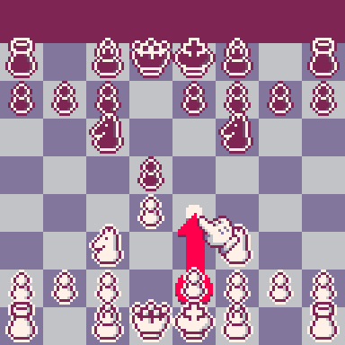

# Pico-8 Games

# Chess
 
[Manual](Games/Chess/Manual.pdf)
# Checkers
 
[Manual](Games/Checkers/Manual.pdf)
# Combo Pool
 
[Manual](<Games/Combo Pool/Manual.pdf>)
# Dino Game
 
[Manual](<Games/Dino Game/Manual.pdf>)
# Minesweeper
 
[Manual](<Games/Minesweeper/Manual.pdf>)
# Picross 1
 
[Manual](<Games/Picross 1/Manual.pdf>)
# Picross 2
 
[Manual](<Games/Picross 2/Manual.pdf>)
# Pigments
 
[Manual](<Games/Pigments/Manual.pdf>)
